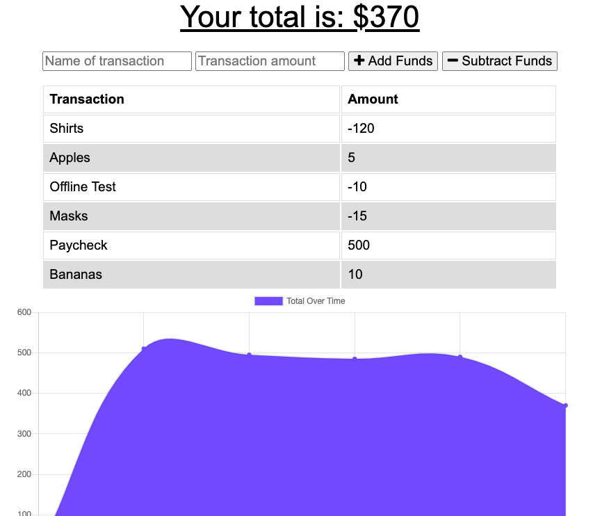

# gt-hw-18-pwa

## Installation

Run npm install after cloning the repo from my GitHub. Then, run node server.js in your terminal.

## Usage

This application was designed as a progressive web application for accessibility and offline access. It allows a user to track their expenses both on and offline and see their updated expenditures once back online.

## Contributing

This was a solo project completed for homework for the Georgia Tech Full-Stack Web Development Bootcamp. However, this homework deserves a special shout out to Jonathan. Thanks, Jonathan!

## License

MIT License

Copyright (c) [2020][maya stucky]

Permission is hereby granted, free of charge, to any person obtaining a copy of this software and associated documentation files (the "Software"), to deal in the Software without restriction, including without limitation the rights to use, copy, modify, merge, publish, distribute, sublicense, and/or sell copies of the Software, and to permit persons to whom the Software is furnished to do so, subject to the following conditions:

The above copyright notice and this permission notice shall be included in all copies or substantial portions of the Software.

THE SOFTWARE IS PROVIDED "AS IS", WITHOUT WARRANTY OF ANY KIND, EXPRESS OR IMPLIED, INCLUDING BUT NOT LIMITED TO THE WARRANTIES OF MERCHANTABILITY, FITNESS FOR A PARTICULAR PURPOSE AND NONINFRINGEMENT. IN NO EVENT SHALL THE AUTHORS OR COPYRIGHT HOLDERS BE LIABLE FOR ANY CLAIM, DAMAGES OR OTHER LIABILITY, WHETHER IN AN ACTION OF CONTRACT, TORT OR OTHERWISE, ARISING FROM, OUT OF OR IN CONNECTION WITH THE SOFTWARE OR THE USE OR OTHER DEALINGS IN THE SOFTWARE.

## URLs

[GitHub Repo](https://github.com/mayastucky/gt-hw-18-pwa)

[Application Site](https://calm-citadel-25670.herokuapp.com/)
